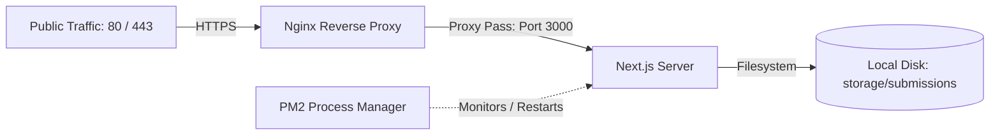

# VM Deployment, Plugins & Whitelist Analysis — CSE Fest 2026

This document presents a comprehensive technical analysis of the Virtual Machine (VM) hosting environment, network/firewall whitelisting, required software plugins, and application-level security policies required to successfully deploy the **CSE Fest 2026 Management Platform**.

---

## 🖥️ 1. VM Hardware & OS Requirements

Because the Next.js application uses dynamic server-side routes, middleware, and local file storage operations (specifically for storing submission proposals), it **cannot** be exported as a static HTML website. It must run as an active Node.js server.

### Operating System & Runtime
- **OS**: Linux (Ubuntu Server 20.04 LTS or 22.04 LTS is highly recommended for stability and packages).
- **Runtime**: **Node.js v20.x or higher** (LTS version) with **pnpm** (preferred for faster, disk-efficient dependency management) or **npm**.

### Hardware Sizing Guidelines
| Environment | Recommended CPU | Recommended RAM | Purpose |
| :--- | :--- | :--- | :--- |
| **Staging / Testing** | 1 vCPU | 2 GB | Core team evaluation and dry-runs. |
| **Production (Hackathon & Registrations)** | 2 vCPUs | 4 GB | Handling concurrent traffic spikes from multiple teams and high-speed upload processing. |

### Disk Storage Sizing & Configuration (50 GB Strict Limit)
- **Total SSD Capacity**: **50 GB** (Fixed Server Limit).
- **Storage Allocation**:
  - **Operating System & Swap space**: ~12 GB (system utilities, caches, temp files)
  - **Codebase & Runtime dependencies**: ~3 GB (Node.js runtime, build outputs, node_modules, PM2 logs)
  - **Available for local uploads & backups**: **~35 GB** max.
- **Submissions & Upload Limit Constraints**:
  - The Nginx reverse proxy configuration allows uploads up to **250MB** per file (to accommodate header overhead). Under a 50 GB partition constraint, space must be managed carefully:
    - **Video Submissions (3-4 mins showcase)**: Restrict to exactly **200MB** max payload.
    - **PDF Uploads (Proposals/Verification)**: Restrict to exactly **5MB** max payload.
    - **Dynamic Exhaustion Guard**: Next.js uses an automated shell/filesystem command helper to verify remaining VM space before saving any file stream. If the root directory has less than **5 GB** free space, uploads are blocked instantly to protect server execution.
    - **Minimal Process Footprint**: As this is a temporary hackathon server, resource-heavy scanning daemons (like ClamAV) are excluded to keep VM CPU/Memory footprint minimal and avoid setup complexity. Simple file format signatures and extension matching are validated at the API layer.
- **File System Permissions**:
  - The storage folder must be writable by the Node.js runner process:
    ```bash
    mkdir -p storage/submissions
    chmod -R 775 storage
    ```

---

## ⚙️ 2. Required Server-Side Software & Plugins

To successfully run and serve the application, three main software components must be installed and configured on the VM:



### 1. PM2 Process Manager
* **Purpose**: Runs the Next.js server daemon in the background, enables automatic clustering, and auto-restarts on system crashes or VM reboots.
* **Commands**:
  ```bash
  sudo npm install -g pm2
  pm2 start npm --name "csefest-server" -- run start
  pm2 startup systemd
  pm2 save
  ```

### 2. Nginx Web Server
* **Purpose**: Serves as a reverse proxy. It terminates public HTTP/HTTPS traffic (ports 80 & 443) and proxies requests to the Next.js application server on port `3000`.
* **Configuration Structure**:
  - **Global Zones (`/etc/nginx/nginx.conf`)**: Define the rate limiting zones inside the `http { ... }` block to monitor incoming traffic globally:
    ```nginx
    limit_req_zone $binary_remote_addr zone=global_limit:10m rate=15r/s;
    limit_req_zone $binary_remote_addr zone=auth_limit:10m rate=5r/m;
    limit_req_zone $binary_remote_addr zone=upload_limit:10m rate=10r/m;
    ```
  - **Site Configuration (`/etc/nginx/sites-available/csefest`)**: Contains the Virtual Host bindings, SSL settings, and reverse proxy location directives:
    ```nginx
    server {
        listen 443 ssl http2;
        listen [::]:443 ssl http2;
        server_name csefest.smuct.edu.bd;

        client_max_body_size 250M; # Support large proposal and video uploads

        # Forward headers for correct client IP detection inside Next.js
        proxy_set_header X-Real-IP $remote_addr;
        proxy_set_header X-Forwarded-For $proxy_add_x_forwarded_for;
        proxy_set_header X-Forwarded-Proto $scheme;
        proxy_set_header Host $host;

        # Reverse Proxy proxy_pass
        location / {
            proxy_pass http://localhost:3000;
            limit_req zone=global_limit burst=30 nodelay;
        }
    }
    ```

### 3. Certbot & Let's Encrypt Nginx Plugin
* **Purpose**: Automatically obtains SSL/TLS certificates and renews them. Secure HTTPS links are mandatory for Google OAuth functionality.
* **Installation, Provisioning, and Verification**:
  ```bash
  # Install Certbot client and its Nginx plugin
  sudo apt install certbot python3-certbot-nginx
  
  # Provision the certificate and auto-configure Nginx
  sudo certbot --nginx -d csefest.smuct.edu.bd
  
  # Dry-run auto-renewal verification (testing validation cron tasks)
  sudo certbot renew --dry-run
  ```

---

## 🔒 3. Network & Firewall Whitelists

The University IT department must configure the network firewall rules for the VM to ensure uninterrupted communication with outer services.

### Inbound Rules (Traffic Allowed Into the VM)
| Port | Protocol | Purpose | Source |
| :--- | :--- | :--- | :--- |
| **80** | TCP / HTTP | Let's Encrypt validation & redirection to HTTPS | Public (`0.0.0.0/0`) |
| **443** | TCP / HTTPS | Secure user access to the platform | Public (`0.0.0.0/0`) |
| **22** | TCP / SSH | Remote management, git updates, SFTP transfers | Restrict to Admin/Dev IPs (Best Practice) |

### Outbound Rules (Traffic Allowed Out of the VM)
To prevent API timeouts and payment/auth failures, the VM firewall must permit outbound HTTPS requests (Port 443) to these domains:

1. **Supabase Core Services**:
   - `https://*.supabase.co` — Auth API, database connection endpoints, and storage.
   - `wss://*.supabase.co` — Realtime WebSockets for notifications and live scoring updates.
2. **Google Authentication & Sheets API**:
   - `accounts.google.com` & `www.googleapis.com` — For Google OAuth login workflow.
   - `sheets.googleapis.com` — For the background spreadsheet sync engine.
3. **Cloudinary (Media Delivery Network)**:
   - `api.cloudinary.com` — For uploading and managing student IDs, payment screenshots, and competition banners.
4. **Package Registries (Deployment Only)**:
   - `registry.npmjs.org` & `registry.yarnpkg.com` — Necessary for installing libraries during `pnpm install` / `npm install`.

---

## 🛡️ 4. Application-Level Content Security Policy (CSP)

The Next.js configuration ([next.config.ts](file:///f:/CSEFEST/cse-fest-vme1/cse-fest-2/next.config.ts)) contains a strict Content Security Policy. Any external resources used in the UI must align with this whitelist:

```typescript
const securityHeaders = [
  {
    key: "Content-Security-Policy",
    value: [
      "default-src 'self'",
      // Scripts: Next.js runtime & Google OAuth scripts
      "script-src 'self' 'unsafe-inline' 'unsafe-eval' https://accounts.google.com",
      // Styling: Tailwind CSS v4 & inline styles for glassmorphism
      "style-src 'self' 'unsafe-inline' https://fonts.googleapis.com",
      // Fonts: Google Web Fonts
      "font-src 'self' https://fonts.gstatic.com",
      // Images: Local assets, blobs, and external HTTPS images (Cloudinary, Google avatars)
      "img-src 'self' data: blob: https:",
      // Connections: API calls & WebSockets
      "connect-src 'self' https://*.supabase.co wss://*.supabase.co https://api.cloudinary.com",
      // Frames: Embedded Google forms, maps, or reCAPTCHA
      "frame-src 'self' https://www.google.com",
      "frame-ancestors 'none'", // Prevent Clickjacking
    ].join("; "),
  },
];
```

> [!WARNING]
> In production, the `'unsafe-eval'` directive should be removed from `script-src` if possible. Next.js only requires `'unsafe-eval'` for fast refresh during development.

---

## 🔗 5. External Integration Credentials & Callback Whitelists

For logins and asset management to function, these third-party platforms must whitelist the production domain:

### 1. Google Cloud Console (OAuth 2.0 Credentials)
- **Authorized JavaScript Origins**: `https://csefest.smuct.edu.bd`
- **Authorized Redirect URIs**: `https://<supabase-project-id>.supabase.co/auth/v1/callback`

### 2. Supabase Auth Dashboard
- **Site URL**: `https://csefest.smuct.edu.bd`
- **Additional Redirect URLs**: `https://csefest.smuct.edu.bd/auth/callback`
- **Google OAuth Provider**: Enabled, with Google Client ID and Secret configured.

### 3. Environment Variable File (`.env`)
The VM must host a production `.env` file containing:
```ini
# Supabase Configuration
NEXT_PUBLIC_SUPABASE_URL=https://<your-project-id>.supabase.co
NEXT_PUBLIC_SUPABASE_ANON_KEY=your-anon-key
SUPABASE_SERVICE_ROLE_KEY=your-service-role-key # Keep this strictly secret on the server!

# Local File Storage Configuration
# The application checks UPLOAD_DIR first, then SUBMISSIONS_DIR, and falls back to "storage/submissions"
UPLOAD_DIR=storage/submissions
SUBMISSIONS_DIR=storage/submissions

# Site domain for authentication redirects
NEXT_PUBLIC_SITE_URL=https://csefest.smuct.edu.bd

# Cloudinary Credentials (For Student IDs and Payment Screenshots)
NEXT_PUBLIC_CLOUDINARY_CLOUD_NAME=your-cloudinary-cloud-name
CLOUDINARY_API_KEY=your-cloudinary-api-key
CLOUDINARY_API_SECRET=your-cloudinary-api-secret
```

---

## 🚀 6. Production Maintenance & Monitoring Checklist

To ensure high availability on July 18, 2026 under a **strict 50 GB storage limit**:
* **Log Rotation**: Configure Nginx and PM2 log rotation daily with size caps (e.g. 10MB per log file) so logs do not fill the disk:
  ```bash
  pm2 install pm2-logrotate
  pm2 set pm2-logrotate:max_size 10M
  pm2 set pm2-logrotate:retain 5
  ```
* **Disk Alert Script**: Set up an hourly cron job to check storage usage and notify administrators (via Discord or Slack Webhook) if disk space exceeds 85%:
  1. Save the following script to `/usr/local/bin/disk-alert.sh`:
     ```bash
     #!/bin/bash
     CURRENT_USAGE=$(df -h / | grep / | head -n 1 | awk '{ print $5 }' | cut -d'%' -f1)
     if [ "$CURRENT_USAGE" -gt 85 ]; then
       curl -X POST -H "Content-Type: application/json" \
         -d '{"content": "🚨 WARNING: Disk Space on CSE Fest VM exceeds 85%! Current usage: '"$CURRENT_USAGE"'%"}' \
         https://discord.com/api/webhooks/your-alert-webhook
     fi
     ```
  2. Make the script executable:
     ```bash
     sudo chmod +x /usr/local/bin/disk-alert.sh
     ```
  3. Schedule the check in the root system crontab (`sudo crontab -e`):
     ```text
     0 * * * * /usr/local/bin/disk-alert.sh
     ```
* **Backup Management**:
  - Run backups *locally* only transiently, pushing them immediately to offsite storage.
  - Delete local backup files after successful remote transfer to avoid double storage consumption.
* **Supabase Backups**: Daily database backups are managed on Supabase side (does not impact VM disk).
* **Upload Retention Policy**: Auto-archive old submission drafts that have been inactive or replaced to external backup and prune them locally to free up disk space.
