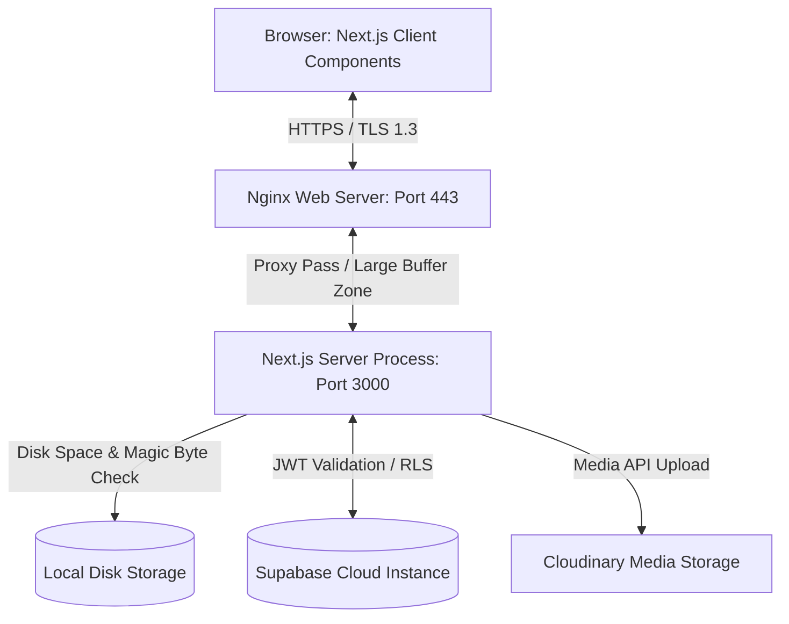

# CSE Fest 2026 Management Platform

### Bangladesh's Next Generation Technology Festival Management Platform

The CSE Fest 2026 Management Platform is a production-grade Web Application and Competition Management System engineered for the Department of Computer Science & Engineering (CSE) and the Department of Computer Science & Information Technology (CSIT) at Shanto-Mariam University of Creative Technology (SMUCT). The system replaces manual registration workflows, Google Forms, and disjointed communication channels with a unified, high-performance platform. It handles multi-step onboarding, offline/online team rosters, secure document-verified submissions, real-time analytics, manual transaction auditing for mobile financial services (bKash/Nagad), automated evaluation engines, and direct spreadsheet exports.

[](https://csefest.smuct.ac.bd)
[](https://github.com/mohammadirfan90/cse-fest-3)
[](LICENSE)

---

## Project Overview

### The Problem
University technology festivals in Bangladesh traditionally rely on manual spreadsheet entries, chaotic Google Forms registrations, and fragmented Messenger threads. This results in data discrepancies, double-registrations, delayed payment verifications, opaque judging scorecards, and high administrative overhead for organizers. Additionally, handling file uploads (proposals and demo clips) under strict server resource constraints on university infrastructure often causes performance bottlenecks.

### The Solution
This platform centralizes the festival lifecycle into a single source of truth:
*   **Public Portal:** An immersive, dark-theme landing page with real-time tickers and dynamic FAQs.
*   **Participant Workspace:** Seamless onboarding, profile completion, team generation, and proposal uploads.
*   **Admin CRM:** A centralized portal for evaluating team rosters, managing CMS tables, approving financial transactions, entering criteria-based scores, and generating reports.

### Target Users
*   **Participants:** Undergraduate students from SMUCT (internal contests) and other universities in Bangladesh (external showcases).
*   **Admins & Coordinators:** Academic faculty and student organizers managing specific event segments.

### Main Workflows
```
[User Signup] ──> [Onboarding Wizard] ──> [Team Setup & Email Invites] ──> [Proposal Submission]
                                                                                │
[Leaderboard] <── [Weighted Judging] <── [Payment Proof Upload] <── [Phase 1 Review (Approve)]
```

---

## Engineering Highlights

This platform was built with strict production requirements in mind:

*   **Production Windows VM Deployment:** The application runs on a university server running a Windows environment, managed by **PM2** and proxied via **Nginx** for high availability.
*   **Nginx Buffer and Header Tuning:** Adjusted HTTP buffer configurations (`proxy_buffer_size 256k`, `proxy_buffers 8 256k`) to prevent `502 Bad Gateway` errors triggered by large cookie headers generated by Supabase JWTs.
*   **Self-Healing Profile Architecture:** Solves the problem of failed database signup triggers during peak registration loads. The backend detects out-of-sync auth profiles on first login and executes a self-healing database routine (`ensureUserAndProfileExists`).
*   **Offline Member Roster Mapping:** Leaders can invite team members offline using their email addresses. When the invited member registers later, the self-healing routine automatically claims the placeholder team slot.
*   **Secure Multi-Tier Upload Validation:** Files are verified at the binary level. The upload engine parses the buffer array to validate file signatures (magic bytes) for PDF and video containers, preventing extension spoofing.
*   **Dynamic Disk Safety Interceptor:** Protects the university server's 50GB storage limit. The upload route executes a Unix `df` shell command at runtime, blocking writes if available disk space drops below 5GB.
*   **Automated Evaluation Engine:** Scoring triggers dynamic rank updates based on highest score, then earlier submission time, and finally earlier team creation time, eliminating manual ranking errors.

---

## Screenshots

### Landing Page

*Modern dark-mode interface with floating technology particles and real-time countdown.*

### Dynamic Competition Catalog

*Dynamic cards showing entry fees, registration timelines, and team restrictions.*

### User Authentication & Login

*OAuth and PKCE Email credential portal.*

### Admin Dashboard (Competition View)

*Administration panel for building contests, configuring rules, and checking metrics.*

---

## Main Features

### Public Website
*   **Hero Countdown Console:** Live countdown timer showing days, hours, minutes, and seconds until the festival.
*   **News Ticker Announcements:** A CMS-managed horizontal scrolling banner displaying live alerts and deadline extensions.
*   **Dynamic FAQ Accordion:** An interactive Q&A section populated directly from administrative database controls.

### Participant Portal
*   **Onboarding Wizard:** A 2-step wizard collecting identity details and academic records (Institution, Student ID, T-Shirt Size) required to access portal actions.
*   **Roster Invitations:** Team dashboard for sending email invitations, accepting/rejecting requests, and transferring leadership.

### Admin Dashboard
*   **Executive Metrics:** Displays total participants, verified teams, expected revenue, and collected revenue.
*   **CSV Spreadsheet Exports:** Direct exports for teams, payments, rankings, and participants, pre-formatted with UTF-8 BOM prefixes for Microsoft Excel.
*   **Audit Logging Trail:** Chronological record of administrative operations (such as exports or score updates) written to `public.audit_logs`.

### Competition Management
*   **Contest Builder:** Forms to manage registration dates, team sizes, entry fees, rulebooks, and weighted evaluation criteria.
*   **Ranking Engine:** Processes criteria scores and calculates leaderboard standings, applying tie-breakers.

### Submission System
*   **Multipart Upload Engine:** Handles proposal PDFs and demo clips.
*   **Magic Byte Scanner:** Validates files at the binary level to prevent malicious uploads.

### Payment Verification
*   **MFS Audit Dashboard:** Review transaction IDs, payment gateway details, and screenshot uploads.
*   **State Machine:** Transition payment states between `pending`, `approved`, `rejected`, and `resubmission_required`.

---

## Technology Stack

| Layer | Technology | Details |
| :--- | :--- | :--- |
| **Frontend** | Next.js (v16.2.9) / React (v19) | App Router, Server Components, and Layouts |
| **Styling** | Tailwind CSS v4 / PostCSS | CSS-in-JS utility styles and animations |
| **Database** | PostgreSQL (Supabase) | Row Level Security (RLS), custom triggers, and functions |
| **Authentication** | Supabase Auth / Google OAuth | PKCE Authorization Code Flow, session cookies |
| **Storage** | Local Filesystem & Cloudinary | Local storage for submissions; Cloudinary for payment screenshots |
| **Caching** | SWR (v2.4.1) | Client-side caching and revalidation |
| **Process Daemon** | PM2 | Background process management and log rotation |
| **Web Server** | Nginx | Reverse proxy, rate limiter, and SSL termination |

---

## Project Architecture



*   **Frontend:** Renders static shells and fetches dynamic data client-side using `SWR`.
*   **Backend:** Next.js Route Handlers (`route.ts`) parse data, check rate limits, and interact with database and file storage services.
*   **Database:** A PostgreSQL instance hosted on Supabase, secured with Row-Level Security (RLS) policies.
*   **Authentication:** Supabase PKCE handles authentication, validating JWTs via secure cookies.
*   **File Storage:** Proposal PDFs are written locally to the server to comply with university policies; screenshots are hosted on Cloudinary to save local disk space.
*   **Deployment:** Promoted through PM2 and proxied via Nginx, which handles SSL certificates, HTTP redirects, and request rate limiting.

---

## Security

### Authentication
Implemented using Supabase PKCE Auth. The authentication middleware (`src/proxy.ts`) reads sessions via a cookie-only check (`getSession()`) first. This prevents redundant database calls and avoids HTTP header overflow issues caused by large JWTs.

### Authorization & RBAC
Access control is determined by the `role` column in `public.users`. Page layouts handle client-side authorization, while API routes and the proxy middleware enforce role restrictions server-side.

### CSRF Protection
The proxy middleware checks all write operations (`POST`, `PUT`, `DELETE`, `PATCH`). It rejects requests if the `Origin` header is present and does not match the `Host` header, preventing cross-site scripting vulnerabilities.

### API Rate Limiting
Enforced on sensitive endpoints using an in-memory sliding window counter (`rate-limit.ts`):
*   **Submissions:** Max 10 requests per minute.
*   **Files:** Max 30 requests per minute.
*   **Profiles:** Max 20 requests per minute.
*   *Memory Leak Prevention:* An interval runs every 5 minutes to clear expired entries.

### Magic Byte File Validation
To prevent security issues from uploaded files with spoofed extensions, `submissionStorage.ts` validates file signatures:
```typescript
export function isValidPDFSignature(buffer: Buffer): boolean {
  return (
    buffer.length >= 4 &&
    buffer[0] === 0x25 && buffer[1] === 0x50 &&
    buffer[2] === 0x44 && buffer[3] === 0x46
  ); // %PDF
}
```

### Path Traversal Protection
All file operations check that the absolute path starts with `SUBMISSIONS_ROOT + path.sep` to prevent directory traversal attacks.

### Disk Safety Checks
Before saving files to the server, the backend runs a disk check:
```typescript
exec("df -BG /", (err, stdout) => { ... })
```
If the remaining space on the root partition is less than 5GB, uploads are blocked to preserve server stability.

### Row Level Security (RLS)
RLS is enabled on all tables. Policies ensure participants can only access their own team records, submissions, and payments, while admins have full system access.

---

## Production Deployment

The application is deployed on a **University Server VM** running **Windows Server** and **Node.js (v20+)**:

### Reverse Proxy & SSL Configuration
Nginx binds to ports 80 and 443, forwarding traffic to the Next.js process on port 3000. It handles HTTP-to-HTTPS redirects and manages SSL certificates.

### Large Header Buffering
To prevent Nginx from returning `502 Bad Gateway` errors due to large Supabase Auth cookies, Nginx buffers are scaled up:
```nginx
proxy_buffer_size 256k;
proxy_buffers 8 256k;
proxy_busy_buffers_size 512k;
large_client_header_buffers 4 32k;
```

### Storage Limits & Monitoring
*   **PM2 Log Rotation:** Logs are rotated when they reach 10MB, keeping a maximum of 5 logs:
    ```bash
    pm2 install pm2-logrotate
    pm2 set pm2-logrotate:max_size 10M
    pm2 set pm2-logrotate:retain 5
    ```
*   **Outbound Whitelisting:** The university firewall is configured to allow traffic to `*.supabase.co`, `api.cloudinary.com`, and Google OAuth services.
*   **Disk Space Alerts:** An hourly cron job runs `disk-alert.sh` to check disk usage and send a Discord webhook notification if usage exceeds 85%.

---

## Performance Optimizations

*   **SWR Client-Side Caching:** Caches API responses and updates them in the background, reducing database load.
*   **Image Format Optimization:** Next.js is configured to generate WebP and AVIF formats, caching optimized images for 30 days.
*   **Partial Range Video Streaming:** Supports HTTP 206 range requests, allowing users to scrub through demo videos without downloading the entire file.
*   **In-Memory API Aggregations:** The admin dashboard compiles analytics in-memory to avoid expensive database joins during peak hours.
*   **Console Logging Stripper:** The Next.js compiler is configured to strip `console.log` statements in production builds to optimize runtime performance.

---

## Database Design

The schema is built on a PostgreSQL database hosted on Supabase, featuring 17 tables and custom triggers:

```
[auth.users]
     │
     └──> [public.users] ──> [profiles]
               │                 │
               ├──> [teams] <────┘
               │      │
               │      ├──> [team_members] (nullable user_id for offline invites)
               │      ├──> [submissions]
               │      └──> [payments]
               │
               └──> [scores] ──> [rankings]
```

### Key Tables & Columns
*   `public.users`: Tracks user roles (`participant`, `admin`).
*   `public.profiles`: Stores academic records and t-shirt sizes.
*   `public.team_members`: Associates users with teams. Supports offline invites by allowing `user_id` to be nullable and storing academic details directly in the table.
*   `public.rankings`: Stores team scores and leaderboard positions.

### Custom Database Triggers
*   `on_auth_user_created`: Automatically creates corresponding records in `public.users` and `public.profiles` when a user signs up.
*   `tr_sync_admin_role`: Updates the user's role to `admin` when added to the `public.admins` table.

---

## Folder Structure

```
cse-fest-3/
├── DOC/                  # Platform specifications and design guidelines
├── nginx/                # Nginx reverse proxy configurations
├── public/               # Static assets (logos, banners)
├── screenshots/          # Platform screenshots used in documentation
├── scripts/              # Automation scripts (backups, disk checks)
├── src/
│   ├── app/              # Next.js App Router Pages & Layouts
│   │   ├── (admin)/      # Admin CRM pages
│   │   ├── (auth)/       # Authentication pages
│   │   ├── (participant)/# Team & submission dashboards
│   │   ├── (public)/     # Marketing pages & landing page
│   │   └── api/          # Route Handlers (API endpoints)
│   ├── components/       # Reusable React components (shadcn/ui)
│   ├── constants/        # Content variables and contact configurations
│   ├── hooks/            # Custom React hooks
│   ├── lib/              # Shared libraries (Supabase, CSV utils, storage)
│   └── proxy.ts          # Authentication middleware
└── supabase/             # Database migrations, schemas, and seeds
```

---

## Getting Started

Follow these steps to run a local development instance of the platform:

### Prerequisites
*   Node.js (v20 or higher)
*   pnpm (v8 or higher) or npm

### 1. Clone and Install Dependencies
```bash
git clone https://github.com/mohammadirfan90/cse-fest-3.git
cd cse-fest-3
pnpm install
```

### 2. Configure Environment Variables
Create a `.env.local` file in the root directory:
```ini
NEXT_PUBLIC_SUPABASE_URL=https://your-project-id.supabase.co
NEXT_PUBLIC_SUPABASE_ANON_KEY=your-anon-key
SUPABASE_SERVICE_ROLE_KEY=your-service-role-key

NEXT_PUBLIC_CLOUDINARY_CLOUD_NAME=your-cloud-name
CLOUDINARY_API_KEY=your-api-key
CLOUDINARY_API_SECRET=your-api-secret

NEXT_PUBLIC_SITE_URL=http://localhost:3000
```

### 3. Run the Development Server
```bash
pnpm dev
```
Open [http://localhost:3000](http://localhost:3000) in your browser to view the application.

---

## Environment Variables

| Variable | Description | Required |
| :--- | :--- | :--- |
| `NEXT_PUBLIC_SUPABASE_URL` | The URL of the Supabase API. Used by the client and server. | Yes |
| `NEXT_PUBLIC_SUPABASE_ANON_KEY` | The anonymous key for the Supabase API. | Yes |
| `SUPABASE_SERVICE_ROLE_KEY` | Bypasses RLS policies. Used only in secure server actions. | Yes |
| `NEXT_PUBLIC_CLOUDINARY_CLOUD_NAME` | Cloudinary name for image hosting. | Yes |
| `CLOUDINARY_API_KEY` | Cloudinary API Key. | Yes |
| `CLOUDINARY_API_SECRET` | Cloudinary API Secret. | Yes |
| `UPLOAD_DIR` | Local path for uploaded files. Defaults to `storage/submissions`. | No |
| `NEXT_PUBLIC_SITE_URL` | Callback domain for OAuth redirects. | Yes |

---

## Available Scripts

*   `pnpm dev`: Runs the Next.js development server.
*   `pnpm build`: Generates the production build.
*   `pnpm start`: Starts the production build.
*   `pnpm lint`: Runs ESLint to check code quality.

---

## API Overview

### Public Endpoints
*   `GET /api/public/competitions`: Lists all published competitions.
*   `GET /api/public/cms/announcements`: Lists published news and announcements.
*   `GET /api/public/cms/ticker`: Lists scrolling news ticker alerts.

### Participant Endpoints
*   `GET /api/profile`: Fetches the user's profile.
*   `POST /api/profile`: Saves onboarding wizard profile data.
*   `POST /api/teams`: Creates a team and invites members.
*   `POST /api/submissions`: Submits proposal files (PDFs, YouTube URLs).
*   `GET /api/submissions/file/[id]?type=pdf`: Streams proposal PDFs.

### Admin Endpoints
*   `GET /api/admin/analytics`: Generates metrics and trends.
*   `GET /api/admin/payments`: Fetches the payment verification queue.
*   `POST /api/admin/payments`: Approves or rejects payment transactions.
*   `POST /api/admin/submissions/score`: Enters scores and recalculates rankings.
*   `GET /api/admin/export?type=[teams/payments/rankings/participants]`: Generates CSV spreadsheets.

---

## Production Deployment Guide

Follow these steps to deploy the application on a **Windows Server VM**:

### 1. Configure the Nginx Web Server
Install Nginx and add the following configuration to `nginx.conf` (located under `nginx/csefest.conf`):
```nginx
server {
    listen 443 ssl http2;
    server_name csefest.smuct.ac.bd;

    ssl_certificate C:/certs/csefest/csefest.smuct.ac.bd-chain.pem;
    ssl_certificate_key C:/certs/csefest/csefest.smuct.ac.bd-key.pem;

    client_max_body_size 250M;

    proxy_buffer_size 256k;
    proxy_buffers 8 256k;
    proxy_busy_buffers_size 512k;

    location / {
        proxy_pass http://localhost:3000;
        proxy_set_header Host $host;
        proxy_set_header X-Real-IP $remote_addr;
        proxy_set_header X-Forwarded-Proto https;
    }
}
```

### 2. Configure PM2 for Background Management
Install PM2 globally and run the production start script:
```bash
npm install -g pm2
pm2 start npm --name "csefest-server" -- run start
pm2 save
```

### 3. Configure Database Backups
Schedule `scripts/backup.sh` to run daily. The script exports the Supabase database, packages uploaded files, encrypts the archives using GPG, and transfers them offsite via SCP.

---

## Future Improvements

*   **Redis Rate Limiting Integration:** Replace the in-memory sliding window map with a centralized Redis instance (e.g., Upstash) to support multi-node scaling.
*   **Automated Excel Sync:** Sync data exports directly to Google Sheets using official APIs, eliminating the need to download CSV files manually.
*   **Certificates Generator:** Generate PDF certificates automatically using HTML Canvas and send them to verified participants.

---

## License

This project is licensed under the MIT License. See the [LICENSE](LICENSE) file for details.
