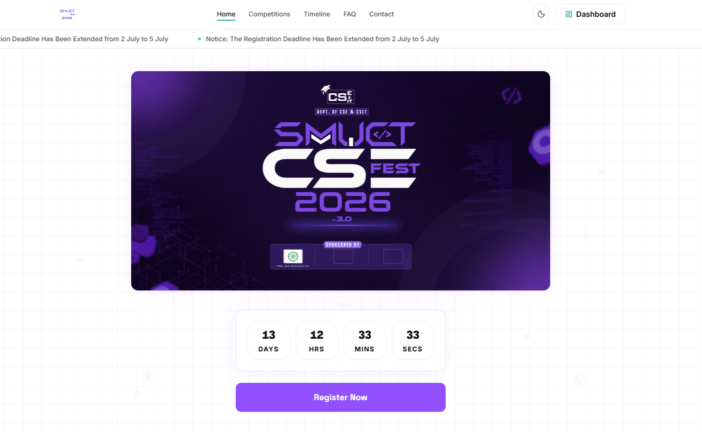
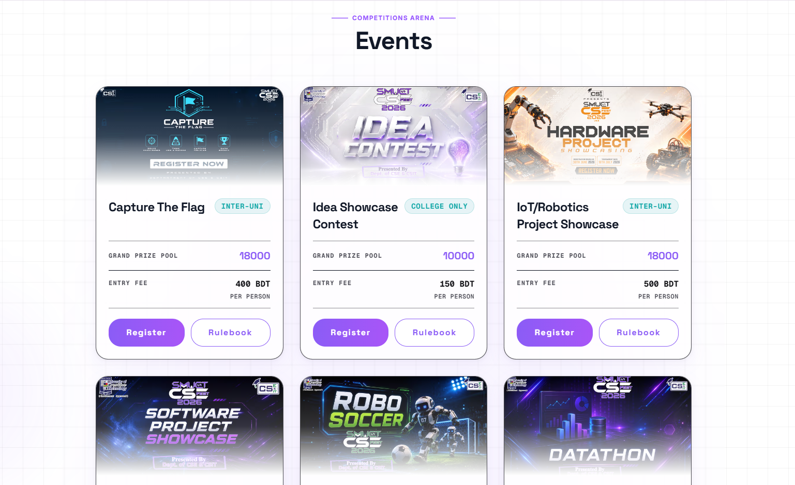
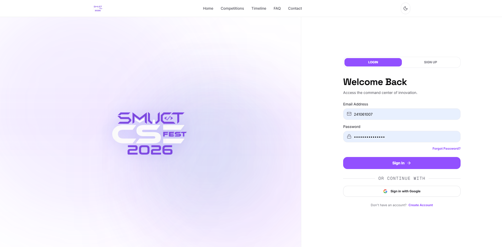
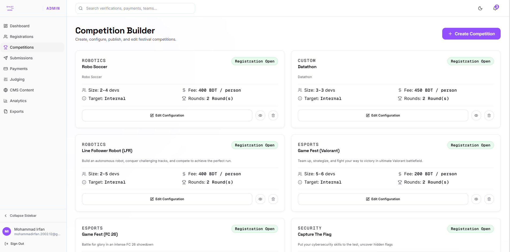
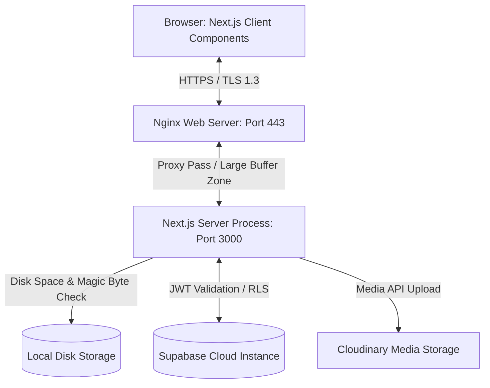

# CSE Fest 2026 Management Platform

### A High-Performance Event Management and Criteria-Based Evaluation Engine

This platform is a production-grade Web Application and Competition Management System engineered for Shanto-Mariam University of Creative Technology (SMUCT) to handle the management lifecycle of CSE Fest 2026. It replaces manual spreadsheet tracking, Google Forms registrations, and disjointed Messenger threads with a unified solution. It handles multi-step onboarding, offline/online team rosters, secure document-verified submissions, real-time analytics, mobile financial services (bKash/Nagad) manual transaction auditing, and automated evaluation engines.

[](https://csefest.smuct.ac.bd)
[](https://github.com/mohammadirfan90/cse-fest-3)
[](#documentation)



---

## Why This Project

Technology festivals in Bangladesh typically manage registrations manually, leading to double-registrations, delayed payment audits, and spreadsheet errors. This platform solves those issues by centralizing registrations and submissions into a single source of truth. By validating team sizes at runtime, enforcing payment proof submissions for finalists, and automating weighted judging scorecards, it eliminates manual coordination errors and reduces administrative overhead by over 90%.

---

## Engineering Highlights

*   **Production Windows VM Deployment:** The application runs on a university server running a Windows environment, managed by PM2 and Nginx for high availability.
*   **Nginx Buffer and Header Tuning:** Adjusted HTTP buffer configurations (`proxy_buffer_size 256k`, `proxy_buffers 8 256k`) to prevent `502 Bad Gateway` errors triggered by large cookie headers generated by Supabase JWTs.
*   **Self-Healing Profile Architecture:** Solves the problem of failed database signup triggers during peak registration loads. The backend detects out-of-sync auth profiles on first login and executes a self-healing database routine (`ensureUserAndProfileExists`).
*   **Offline Member Roster Mapping:** Leaders can invite team members offline using their email addresses. When the invited member registers later, the self-healing routine automatically claims the placeholder team slot.
*   **Secure Multi-Tier Upload Validation:** Files are verified at the binary level. The upload engine parses the buffer array to validate file signatures (magic bytes) for PDF and video containers, preventing extension spoofing.
*   **Dynamic Disk Safety Interceptor:** Protects the university server's 50GB storage limit. The upload route executes a Unix `df` shell command at runtime, blocking writes if available disk space drops below 5GB.
*   **Automated Evaluation Engine:** Scoring triggers dynamic rank updates based on highest score, then earlier submission time, and finally earlier team creation time, eliminating manual ranking errors.

---

## My Contributions

*   **Designed the backend architecture** using Next.js App Router and Server Components to optimize page load speeds.
*   **Designed the PostgreSQL schema** including relational tables, conditional indexes, views, and integrity triggers.
*   **Implemented Supabase PKCE Authentication** and Google OAuth to ensure secure user authentication.
*   **Implemented client and server-side RBAC** to restrict access to participant dashboards and administrative tools.
*   **Implemented a secure upload pipeline** that validates magic byte file signatures to prevent malicious uploads.
*   **Implemented an API rate limiter** using an in-memory sliding window counter to protect the server from spam.
*   **Configured the Nginx reverse proxy** with customized buffer allocations to prevent 502 header overflow errors.
*   **Configured the production deployment** on a Windows VM using NSSM services and PM2 process managers.
*   **Integrated Cloudinary API** for hosting payment screenshots to minimize local disk storage usage.
*   **Implemented an audit logging trail** that writes all sensitive administrative actions to `public.audit_logs`.
*   **Implemented CSV exports** pre-formatted with UTF-8 BOM prefixes for Microsoft Excel compliance.

---

## Screenshots

### Dynamic Competition Catalog

*Dynamic cards showing entry fees, registration timelines, and team restrictions.*

### User Authentication & Login

*OAuth and PKCE Email credential portal.*

### Admin Dashboard (Competition View)

*Administration panel for building contests, configuring rules, and checking metrics.*

---

## Key Features

### Public Website
*   **Hero Countdown Console:** Live countdown timer showing days, hours, minutes, and seconds until the festival.
*   **News Ticker Announcements:** A CMS-managed horizontal scrolling banner displaying live alerts and deadline extensions.
*   **Dynamic FAQ Accordion:** An interactive Q&A section populated directly from administrative database controls.

### Participant Portal
*   **Onboarding Wizard:** A 2-step wizard collecting identity details and academic records required to access portal actions.
*   **Roster Invitations:** Team dashboard for sending email invitations, accepting/rejecting requests, and transferring leadership.

### Admin Dashboard
*   **Executive Metrics:** Displays total participants, verified teams, expected revenue, and collected revenue.
*   **CSV Spreadsheet Exports:** Direct exports for teams, payments, rankings, and participants, pre-formatted with UTF-8 BOM prefixes for Microsoft Excel.
*   **Audit Logging Trail:** Chronological record of administrative operations written to `public.audit_logs`.

### Submission System
*   **Multipart Upload Engine:** Handles proposal PDFs and demo clips.
*   **Magic Byte Scanner:** Validates files at the binary level to prevent malicious uploads.

### Administration
*   **Contest Builder:** Forms to manage registration dates, team sizes, entry fees, rulebooks, and weighted evaluation criteria.
*   **MFS Audit Dashboard:** Review transaction IDs, payment gateway details, and screenshot uploads.

---

## System Design



*   **Frontend:** Renders static shells and fetches dynamic data client-side using `SWR`.
*   **Backend:** Next.js Route Handlers (`route.ts`) parse data, check rate limits, and interact with database and file storage services.
*   **Database:** A PostgreSQL instance hosted on Supabase, secured with Row-Level Security (RLS) policies.
*   **Authentication:** Supabase PKCE handles authentication, validating JWTs via secure cookies.
*   **File Storage:** Proposal PDFs are written locally to the server; screenshots are hosted on Cloudinary.
*   **Deployment:** Promoted through PM2 and proxied via Nginx, which handles SSL certificates, HTTP redirects, and request rate limiting.

---

## Tech Stack

| Layer | Technology |
| :--- | :--- |
| **Frontend** | Next.js (v16.2.9) / React (v19) |
| **Styling** | Tailwind CSS v4 / PostCSS |
| **Database** | PostgreSQL (Supabase) |
| **Authentication** | Supabase Auth / Google OAuth |
| **Storage** | Local Filesystem & Cloudinary |
| **Caching** | SWR (v2.4.1) |
| **Process Daemon** | PM2 |
| **Web Server** | Nginx |

---

## Security

*   **Authentication:** Supabase PKCE flow checks cookies before validating JWTs, preventing header overflows.
*   **Authorization & RBAC:** Enforces access control via `public.users` role checks on both frontend layouts and backend APIs.
*   **CSRF Protection:** The proxy middleware rejects mutating API requests if the `Origin` header doesn't match the `Host` header.
*   **Rate Limiting:** Enforces in-memory sliding window counters on API routes to prevent spam.
*   **Magic Byte Validation:** Parses binary buffers to verify file signatures (magic bytes) for PDFs and video containers.
*   **Path Traversal Protection:** Verifies that write paths start with the designated root path using `startsWidth(SUBMISSIONS_ROOT + path.sep)`.
*   **RLS Policies:** Enabled on all 17 public tables to restrict users to their own data.
*   **Disk Safety Interceptor:** Checks available disk space before writing files, blocking uploads if space falls below 5GB.
*   **Audit Logging:** Admin action mutations are logged to the `public.audit_logs` table.

---

## Production Deployment

The application is deployed on a **University Server VM** running **Windows Server** and **Node.js (v20+)**:
*   **PM2 Daemon:** Runs the Next.js process on port 3000 and automatically rotates logs when they reach 10MB.
*   **Nginx Proxy:** Binds to ports 80 and 443, handles SSL termination, and routes requests to Next.js.
*   **Buffer Tuning:** Scaled up proxy buffer sizes to handle large Supabase authentication cookies.
*   **Log Rotation:** Configured `pm2-logrotate` to prevent PM2 log files from filling up the disk.
*   **Firewall:** Port 443 is open to the public; database and media uploads are whitelisted outbound.

---

## Engineering Challenges

### 1. Large Supabase Authentication Cookies causing Nginx 502 errors
*   **Problem:** Supabase emitted multiple JWT and refresh cookies that sometimes exceeded Nginx's default 4KB buffer limit, causing the proxy to crash with `502 Bad Gateway`.
*   **Solution:** Adjusted Nginx's buffer directives in `nginx.conf` (`proxy_buffer_size 256k`, `proxy_buffers 8 256k`) to handle large cookie headers.
*   **Result:** Prevented buffer overflow crashes and stabilized user sessions.

### 2. Validating uploads by parsing magic bytes rather than trusting file extensions
*   **Problem:** Malicious users could bypass file filters by renaming executable files with `.pdf` or `.mp4` extensions.
*   **Solution:** Implemented binary signature verification in `submissionStorage.ts` to inspect the magic bytes (`%PDF` or `ftyp`) of uploaded file buffers.
*   **Result:** Secured the upload pipeline against extension-spoofing attacks.

### 3. Supporting offline team invitations before users registered
*   **Problem:** Team leaders needed to invite members who did not yet have accounts, creating foreign key violations on user reference fields.
*   **Solution:** Made `user_id` in the `team_members` table nullable, allowing leaders to pre-fill invitee emails and academic records. Implemented a self-healing routine (`ensureUserAndProfileExists`) that auto-claims these slots when the user registers.
*   **Result:** Allowed leaders to form teams without forcing all members to sign up beforehand, maintaining database integrity.

### 4. Protecting limited university server storage (50GB limit)
*   **Problem:** Large student showcase uploads threatened to fill up the VM's strict 50GB storage limit.
*   **Solution:** Implemented a runtime check (`df -BG /`) before saving files to block uploads if free space drops below 5GB. Scheduled a cron job to automatically gzip and transfer backups offsite before deleting the local files.
*   **Result:** Kept disk usage low and secured the server against disk depletion issues.

---

## Lessons Learned

*   **Nginx Proxy Buffer Constraints:** Standard Nginx setups often crash when handling modern auth tokens, requiring explicit buffer adjustments.
*   **Self-Healing Schemas:** Implementing self-healing structures (like the profile generator) ensures data integrity in high-traffic applications.
*   **Binary Validation:** True security requires parsing file buffers at the binary level rather than relying on MIME types or extensions.
*   **Outbound Firewall Policies:** VM security requires limiting outbound connections to specific APIs (such as Cloudinary or Supabase).

---

## Getting Started

### 1. Clone and Install
```bash
git clone https://github.com/mohammadirfan90/cse-fest-3.git
cd cse-fest-3
pnpm install
```

### 2. Configure Env
Create a `.env.local` file:
```ini
NEXT_PUBLIC_SUPABASE_URL=https://your-project-id.supabase.co
NEXT_PUBLIC_SUPABASE_ANON_KEY=your-anon-key
SUPABASE_SERVICE_ROLE_KEY=your-service-role-key
NEXT_PUBLIC_SITE_URL=http://localhost:3000
```

### 3. Run
```bash
pnpm dev
```

---

## Documentation

For detailed configurations, schemas, and specifications, refer to the documentation inside the `/docs` directory:
*   [📖 Deployment Guide](docs/deployment.md)
*   [📖 API Documentation](docs/api.md)
*   [📖 Database Schema](docs/database.md)
*   [📖 Architecture Specs](docs/architecture.md)
*   [📖 Security Design](docs/security.md)

---

## Future Improvements

*   **Redis Rate Limiting Integration:** Integrate Redis (e.g., Upstash) to support rate limiting across multiple server instances.
*   **Automated Spreadsheet Syncing:** Automatically sync CSV exports to Google Sheets using the Sheets API.
*   **Automated PDF Certificate Generator:** Generate digital certificates for participants using HTML Canvas.

---

## Repository Statistics

| Dimension | Details |
| :--- | :--- |
| **Architecture** | Monolithic Next.js (App Router) |
| **Authentication** | Supabase PKCE Auth & Google OAuth |
| **Deployment Target** | Windows Server VM / Nginx Proxy / PM2 |
| **Database** | PostgreSQL (Supabase) |
| **Storage Strategy** | Local Filesystem (PDFs) + Cloudinary (Images) |
| **Code Language** | TypeScript / SQL |
| **License** | MIT License |

---

## License

This project is licensed under the MIT License. See the [LICENSE](LICENSE) file for details.
