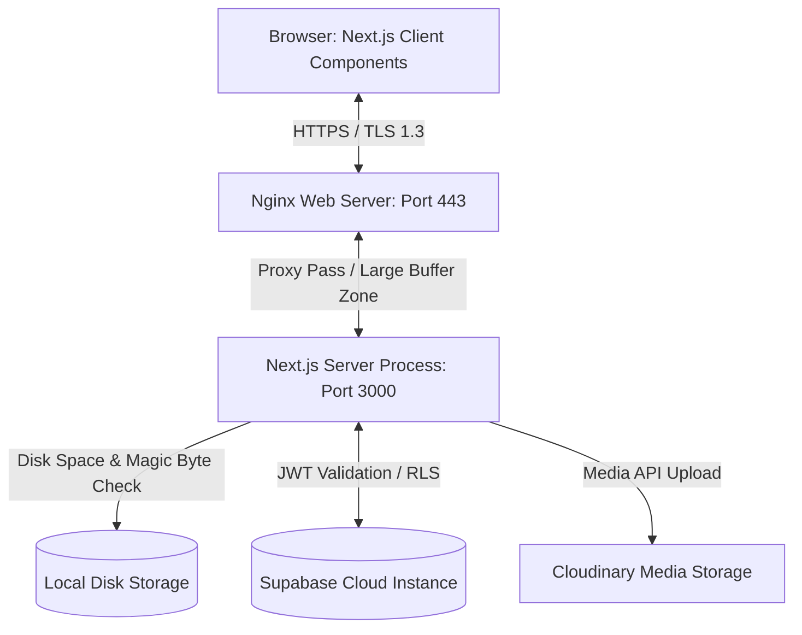

# System Architecture

This document details the system design, components, and data flows of the CSE Fest 2026 Management Platform.

---

## 🏗️ System Components

### 1. Frontend
*   **Next.js Client Components:** Handles client-side rendering and interface states.
*   **SWR Data Fetching:** Implements client-side caching and background revalidation, reducing database query volume.

### 2. Backend
*   **Next.js Server Components & Route Handlers:** Serves as the API layer, checking request parameters, rate limits, and handling database interactions.
*   **Local File Storage Manager:** Streams uploaded PDF files directly to the server's filesystem using `node:fs` streams.

### 3. Database & Storage
*   **Supabase PostgreSQL:** Stores structural data and enforces RLS policies.
*   **Cloudinary:** Hosts payment verification screenshots to reduce local storage usage.

### 4. Deployment Infrastructure
*   **Nginx Reverse Proxy:** Proxies public traffic to the Next.js process, manages SSL certificates, and handles rate limiting.
*   **PM2 Process Manager:** Maintains the background process and manages log rotation to prevent storage issues.
